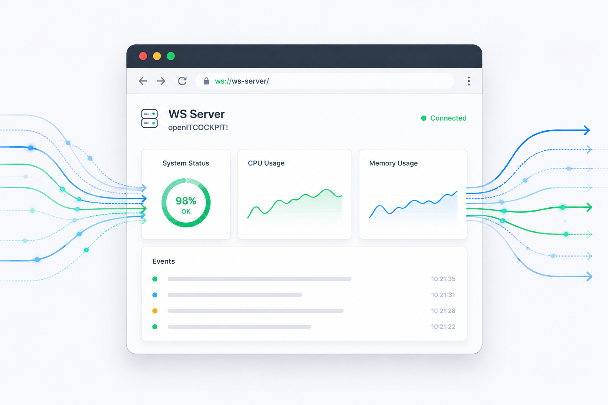

# openITCOCKPIT WebSocket Server



This project is the WebSocket Server for openITCOCKPIT. It is designed to run on the main openITCOCKPIT system (not on satellite systems).

## Features

- Broadcast messages to all connected clients
- Send messages to a single client
- Send messages to a specific browser instance of a client
- Send messages to mobile devices through an external push gateway (webhook)
- Authentication via the `Sec-WebSocket-Protocol: access_token, <API_KEY>` header

## Service configuration

**Systemd Service** For backwards compatibility reasons we decided to keep the old service name `push_notification.service`


```
systemctl status push_notification.service
```


**Bind host** `127.0.0.1`.


**Bind port** `8083`

## Environment variables

| ENV            | Description                                                                                                                    | Default         |
|----------------|--------------------------------------------------------------------------------------------------------------------------------|-----------------|
| `OITC_ADDRESS` | Address or FQDN of the openITCOCKPIT Server. This is used by the `send_push_notification` command to send the POST Request to. | `openitcockpit` |
| `MYSQL_DEBUG`  | If set to `1`, [Bun debug](https://bun.uptrace.dev/guide/debugging.html) will be enabled and print SQL queries to stdout.      | `0`             |


## Authentication

All WebSocket connections must provide a valid API key using the `Sec-WebSocket-Protocol` header:

```
Sec-WebSocket-Protocol: access_token, <API_KEY>
```

The API key itself is a random generated shared secret during the installation of openITCOCKPIT:
https://github.com/openITCOCKPIT/openITCOCKPIT/blob/2fe013afa8b6cec2e74667d634a5d3157083be67/SETUP.sh#L310-L312

## Architecture

- The server manages WebSocket connections for real-time communication.
- Supports sending notifications to browsers and mobile devices.
- Mobile device notifications are relayed through an external push gateway (webhook).
- The server is intended to be deployed on the main openITCOCKPIT system.

## Build WebSocket Server
```
go build -o push_notificationd ./cmd/daemon/main.go
```


## Build the Send Push Notification Command
This command is used by the monitoring engine (Naemon) to send push notifications
to the clients browser or mobile device.
The binary will send a HTTP POST request to the Websocket Server through the `/message` endpoint and exit.

```
go build -o send_push_notification ./send_push_notification.go
```

Example:
```
./send_push_notification -t service -hostuuid "7d0da8f5-3284-4862-b0ba-d0efcc48f20d" -serviceuuid "ed34425b-c9c4-4e0c-ad57-c4fd5a64ba8f" -state 0 -output "Test 123" -user-id 1
```

# License

```
The MIT License (MIT)

Copyright (c) 2026 AVENDIS GmbH

Permission is hereby granted, free of charge, to any person obtaining a copy
of this software and associated documentation files (the "Software"), to deal
in the Software without restriction, including without limitation the rights
to use, copy, modify, merge, publish, distribute, sublicense, and/or sell
copies of the Software, and to permit persons to whom the Software is
furnished to do so, subject to the following conditions:

The above copyright notice and this permission notice shall be included in
all copies or substantial portions of the Software.

THE SOFTWARE IS PROVIDED "AS IS", WITHOUT WARRANTY OF ANY KIND, EXPRESS OR
IMPLIED, INCLUDING BUT NOT LIMITED TO THE WARRANTIES OF MERCHANTABILITY,
FITNESS FOR A PARTICULAR PURPOSE AND NONINFRINGEMENT. IN NO EVENT SHALL THE
AUTHORS OR COPYRIGHT HOLDERS BE LIABLE FOR ANY CLAIM, DAMAGES OR OTHER
LIABILITY, WHETHER IN AN ACTION OF CONTRACT, TORT OR OTHERWISE, ARISING FROM,
OUT OF OR IN CONNECTION WITH THE SOFTWARE OR THE USE OR OTHER DEALINGS IN
THE SOFTWARE.
```